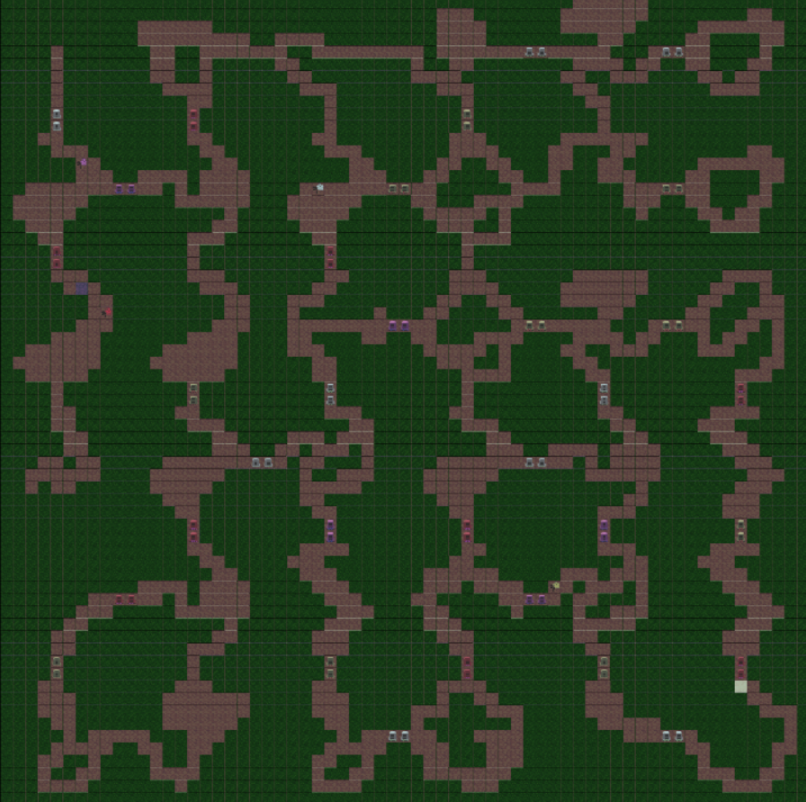
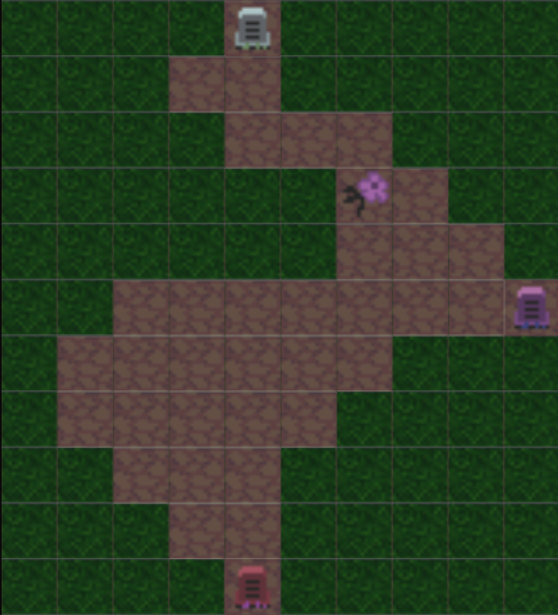
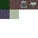

# Final Project!

#### Introduction
- What motivates your project?

We want to create a dungeon crawler rogue-like game. The basic idea is to have a player start in a procedurally generated dungeon and have the player get to the final room and
proceed to the next level. We want there to be some number of "abilities" that the player can unlock, and some obstacles/puzzles that can't be bypassed except by the use
of these abilities. For the generator, we want to be able to take in a set of inputs (placements of points of interests, obstacle/puzzle elements, start and end positions) which would then be used to generate a solvable dungeon. There may or may not be combat elements based on time contraints, but basic combat elements with enemies/boss seem very possible. This game would be played from a top-down view (like 2.5d) on a grid (although this could probably be changed to free-form/hexagonal/etc with enough persuasion).

#### Goal
- What do you intend to achieve with this project?

We want to be able to generate a solvable dungeon with obstacle and unlockable abilty elements. We also want to be able to incorporate a level of "hand-craftedness" by being
able to generate the dungeon when given placements of key elements and perhaps path retrictions (like placed walls). Solvable here means the player is able to get to the final room without encountering a configuration where the player can't get to the end because an ability is locked behind an unbypassable obstacle. It'd be nice to have the game be playable.

#### Inspiration/reference:

Our inpiration comes from a couple games, Crypt of the Necrodancer and some of the older 2D Legend of Zelda games as well as other dungeon generators online.

Crypt of the Necrodancer gameplay: https://youtu.be/3dQU5QK_Bh8
We like how in this game the dungeon is generated using a start and end goal, and the entire level is filled with enemies to get past in order to descend the staircase.

Legend of Zelda: Link's Awakening: https://youtu.be/UQlP9sHf5Ho?t=3927
In this snippet, we see how Link equips a feather to jump over a pit to kill enemies and get to the next room, a similar idea to what we want to implement with "abilities" solving "obstacles"

Mario Maker: https://youtu.be/w3FJDipEdtA
The idea of placing down elements on a map would be similar to (but less complex than) how objects are placed to handcraft a Mario Maker level. However we want procedural generation to still take the reins and generate content.

Basic dungeon generator: https://donjon.bin.sh/d20/dungeon/
Just a basic dungeon generator but one that would be similar to how we plan to generate a 2D grid dungeon

#### Specification:

Developer mode to enable placing of elements to be used in the generation of a dungeon level. Be able to define other rules such as walls that the generator must obey.

#### Techniques:

Pathfinding algorithms (DFS,BFS, Uniform Cost Search, etc) https://www.redblobgames.com/pathfinding/a-star/introduction.html

#### Design:

