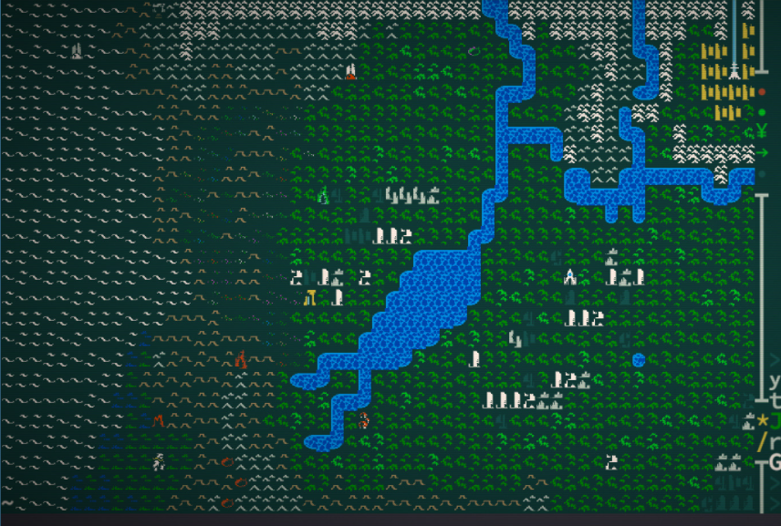
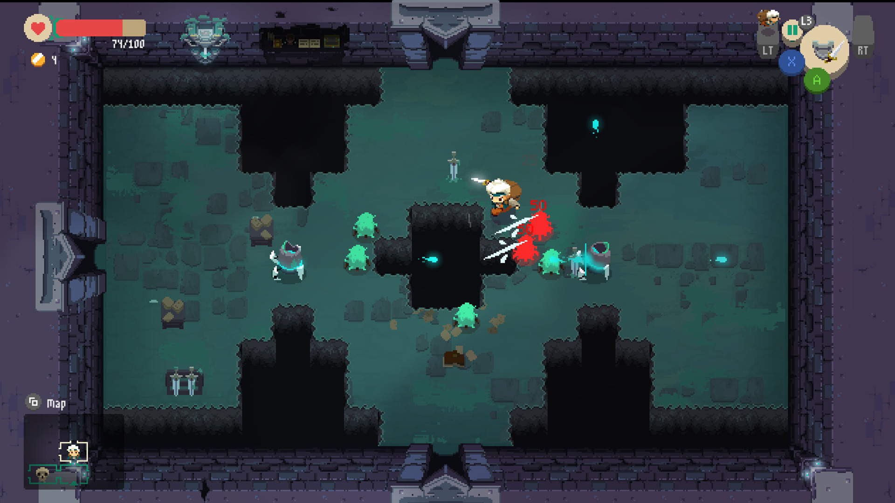
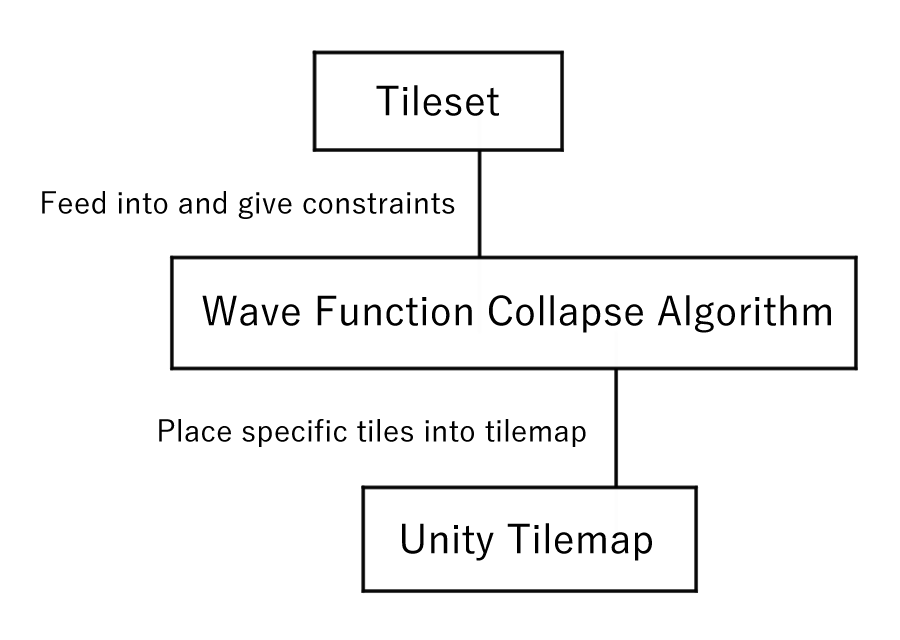

# Topdown Dungeon Generator

#### Introduction
In this project I will be implementing a topdown dungeon generator in Unity using Wave Function Collapse. I am interested in video game development and was curious about how dungeons were being generated in Roguelikes / Roguelites. Through this project I hope to gain exposure in procedural generation techniques for maps and dungeons.

#### Goal
The main goal is to create a topdown dungeon generator that generates at runtime, using tiles. A secondary goal is to create collisions for the walls and make a simple game using the generated dungeons.

#### Inspiration/reference:
[Martin Donald's Superpositions, Sudoku, the Wave Function Collapse algorithm](https://www.youtube.com/watch?v=2SuvO4Gi7uY)

[Robert Heaton's Wave Function Collapse Explained]()

* Overworld generation in Caves of Qud

* Dungeon generation in Moonlighter (not necessarily from WFC)

#### Specification and Features:
* Runtime generation of a tile based, topdown dungeon using WFC trained on a tileset.
* If time allows, the player will be able to move a character around the dungeon, which will have collisions for bounds.
* If time allows, player will be able to fight enemies in the dungeon.

#### Techniques:
The core of this project will be an implementation of Wave Function Collapse, an algorithm for procedurally generating textures or tilemaps using a small input texture or tileset ([WFC overview](https://github.com/mxgmn/WaveFunctionCollapse)). The algorithm will be given a tileset where each tile has a constraint on the types of tiles that could be adjacent to it. The dungeon will consist of a large tilemap, where each tile in the tilemap will begin as a superposition (all tiles could possibly be in this spot), and WFC will begin choosing specific tiles for these spots and propagating adjacency constraints until each superposition has collapsed into a single, specific tile.

#### Design:
A tileset along with tile constraints will be fed into the WFC algorithm / tilemap generator. The generator will then modify a Unity tilemap at runtime, editing specific tiles of the tilemap as the possibilities of tiles collapse. This Unity tilemap will then be used in the game. If time allows, tilemap colliders will be created using Unity's builtin Tilemap Collider 2D component. A player character and enemies may also be added into the game.

* Diagram of core components

#### Timeline:
* 11/15 - 11/22: Implement core functionality of WFC. Should be able to generate dungeons.
* 11/22 - 11/29: Fix bugs and if possible add player character and enemies.
* 11/29 - 12/6: Add particle effects and GUI.
