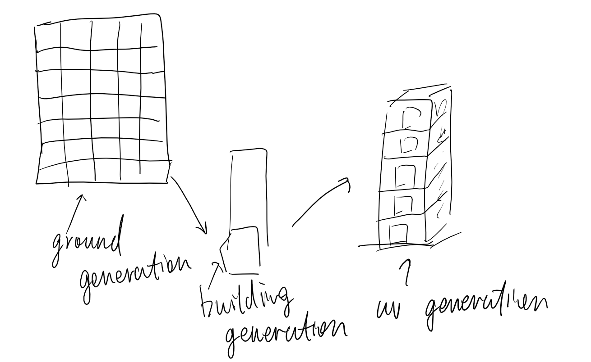

### Design Doc

#### Introduction
Modeling and building a large city can be tedious and hard to manage, so a procedural city generator can save the day for artists and provides extra control over many parameters such as streets, buildings, props and other game specific elements such as traffic, and random events.

#### Goal
We intend to make a city generator in NYC style with procedural roads and buildings. The generator could be exported to a game engine like UE4 with adjustable parameters.

#### Inspiration/reference:
- Marvel's Spider-Man https://www.youtube.com/watch?v=D0ERCi9mMZg

#### Specification:
- Procedurally generate roads (city structures)
- Procedurally generate buildings
- Automatically fit the textures

#### Techniques:
- Procedural UV mapping: Given the building size, generate the according UV map. 
- Road generation: Use noise functions or L-Systems to generate the position of the roads.
- Building generation: Procedural extrusion of a plane or a box to generate a random building.

#### Design:

#### Timeline:
- Lanqing Bao:
- 11.22: 	Find a nice building texture and calculate the uv texture mapping for a random size building.
- 11.29: Integrate the uv calculation into teammate ground generation.
- 12.06: Touch up and maybe add more texture maps.

- Yilei Li:
- 11.22: Find a way to procedurally generate a building from a blank ground. Visualize the building in a simple way.
- 11.29: Incorporate with Haowei to generate buildings on the ground layout.
- 12.06: Incorporate with Lanqing to generate polished buildings.

- Haowei Li:
- 11.22: Find a way to generate the road structure or the city, and visualize the roads in a simple way.
- 11.29: Define the blocks for procedural buildings generation.
- 12.06: Integrate the roads with the procedural buildings with other teammates. Polish all the work.

#### MileStone 1:
- Progress: We have figured out using the grid, scatter, and blast node in Houdini to generate the basic road structure of the city. The city can now generate roads with random citizens, side walks, and street lights. (All represented by simple geometries)
- Screenshot: \

