# Coraline Walking Simulator (by Di Lu and Serena Gandhi)

## Design Doc

#### Project Motivation
- Di Lu and Serena Gandhi both share a deep love for Coraline (2009). We knew we wanted to incorporate the visual elements from the film, and while watching a "in the making" video of Coraline, stumbled upon the scene in which Coraline runs away (https://www.youtube.com/watch?v=91nfNp7MVIw) and noticed that it has great procedural graphics potential.

#### Goal
- In this project, Di and Serena intend to create a presentable and working project that will fit well on a demo reel. We also hope to deepen our understanding of the procedural pipeline as it applies to larger projects. Neither Di or Serena have worked on a project of this scope with so much freedom, so we are excited to learn from this process! 

#### Inspiration/reference:
- https://www.youtube.com/watch?v=91nfNp7MVIw
- 
- 
- 

#### Specification:
- In this project, Di and Serena intend to create a walking simulator in which the player can move around an intially fully-populated forest in the style of Coraline. The further from their spawn point they travel, the more sparse, cubist, and pixelated the scene becomes, just like in the scene from the movie. While diverging from the spawn point, trees will begin to look less natural, just as they do in the film. The forest and trees are all generated using instanced rendering and the terrain is generated as the player walks. Additionally, this project will incorporate procedural elements by altering the color palette or "season" and using randomness to generate and place the trees and assets in the forest. This project will require use of keyboard and mouse controls. As a bonus, we may also feature royalty-free music.

#### Techniques:
Here are the main technical/algorithmic tools we’ll be using:
- L-Systems (http://paulbourke.net/fractals/lsys/)
- Noise Functions (https://graphics.pixar.com/library/WaveletNoise/paper.pdf)
- Procedurally-generated realtime terrain creation (https://remptongames.com/2021/02/28/how-minecraft-generates-massive-virtual-worlds-from-scratch/)

#### Design:
- Here's how our program will fit together:

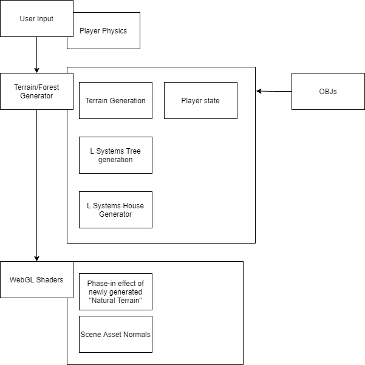

#### Timeline:
- 11/22: Di- OBJs, L-Systems Tree Generation, Terrain Generation; Serena- Player Physics, Player State,
- 11/29: Di and Serena- phase-in effect and incorporating player state with generation properties (by the end of this week, hopefully  have black sky and white terrain with structures, which will both exhibit desired behavior such as phasing in/out in a pixelated manner and becoming less natural). 
- 12/06: Di- add textures, polish OBJs, normals; Serena- flower assets, House generation (stretch)

## Milestone 2: Implementation part 1 (due 11/22)
### Current Progress:
Thus far, we have created an engine that the player can move around in using keyboard and mouse controls. We have set constraints that move the player back to spawn if they travel too far, and we also change the color of the sky and terrain as the player moves farther away from spawn.

### Trouble Makers:
- instanced rendering trees
- modifying grammar
- converting lambertian shader to account for adjustments due to distance
- keeping player grounded

### Example Images:

Milestone 1: 

This week, Serena and Di implemented player state, player movement, random scattering of trees, and distance-based tree generation. The terrain currently contains many trees which are shorter and more "natural-looking" the closer to the origin, and more "rectangular" as it gets further away. As the player moves away, the trees become taller until eventually the player is reset to the beginning of the plane. 

Milestone 2:

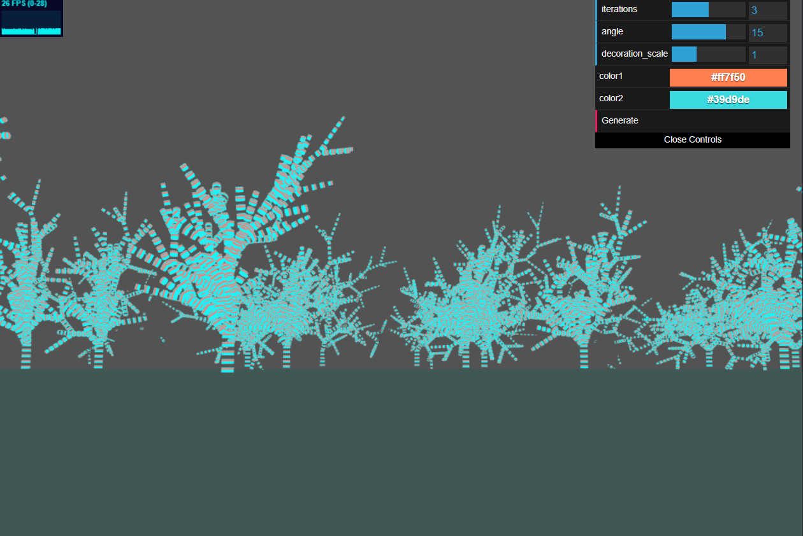
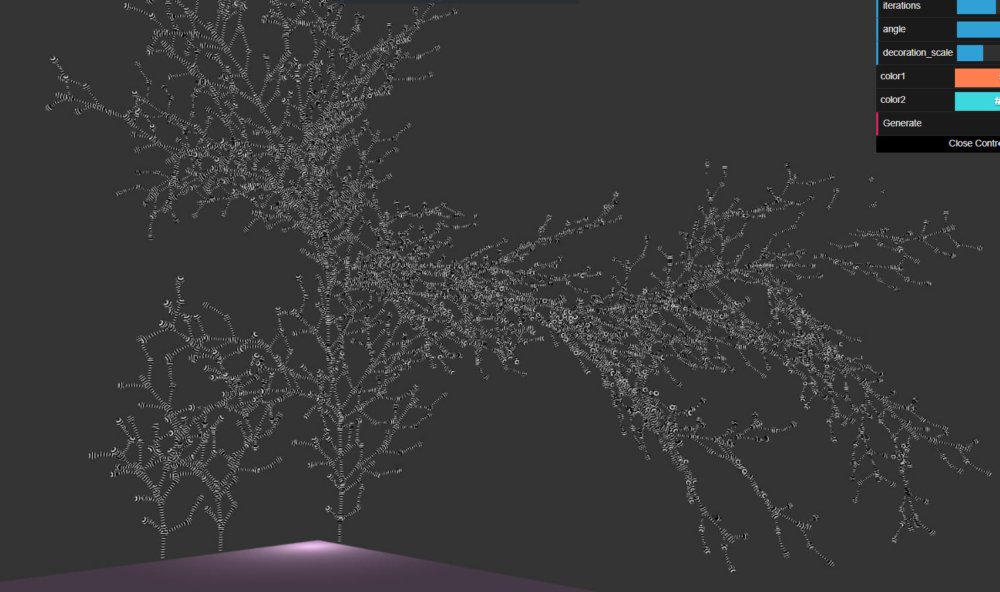
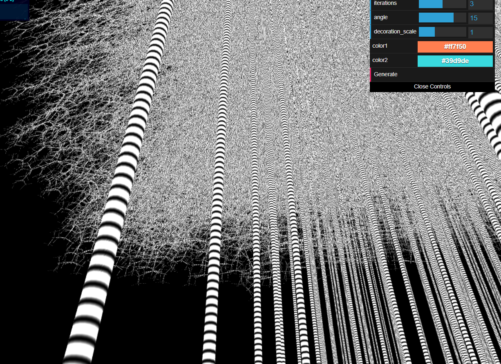

This week, Serena and Di implemented better L-systems grammar although now we are struggling with the trees becoming taller and appearing more menacing. Serena implemented a post-processing effect when the player teleports back to the origin. 

Milestone 3:

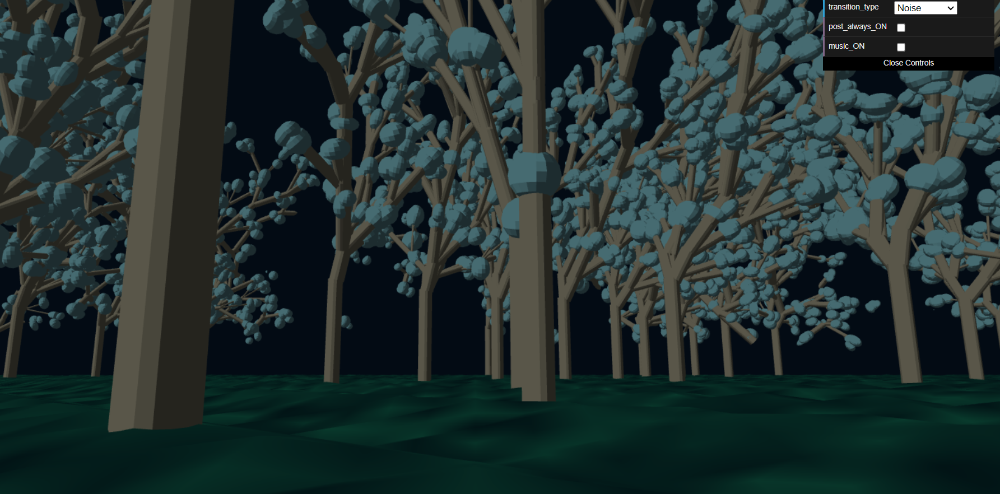
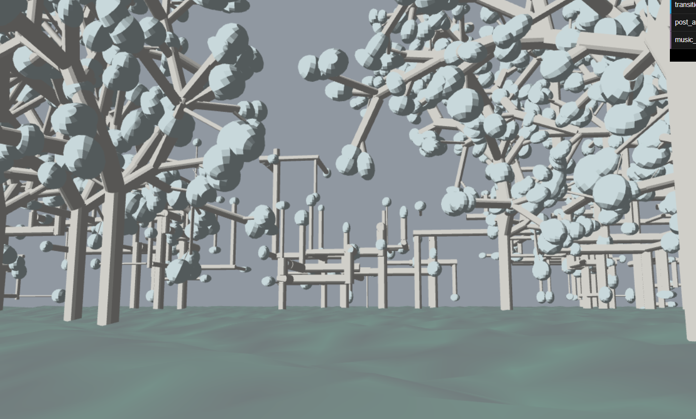
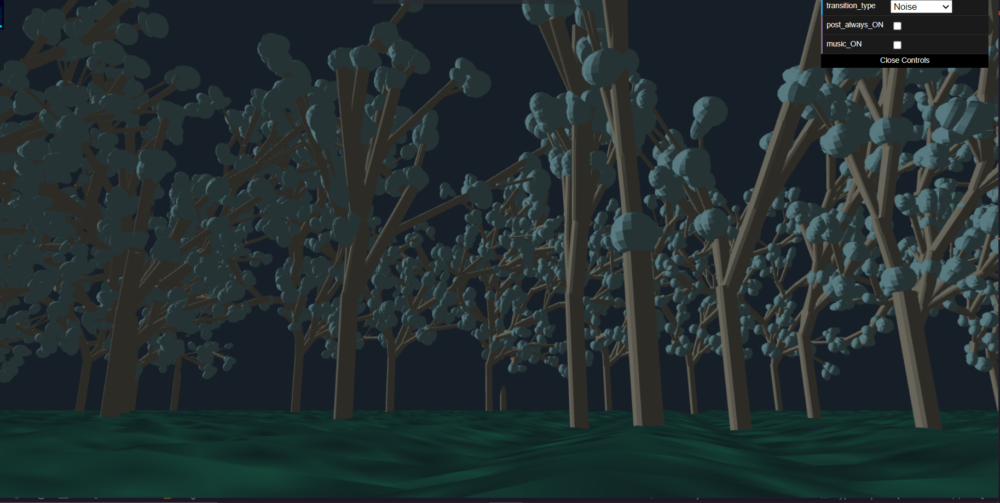
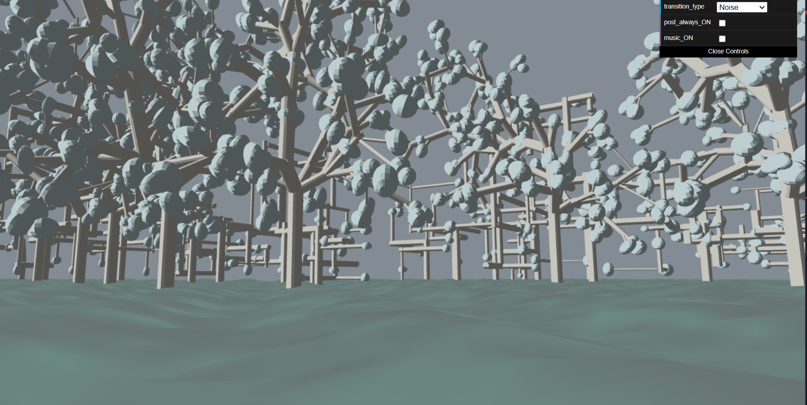
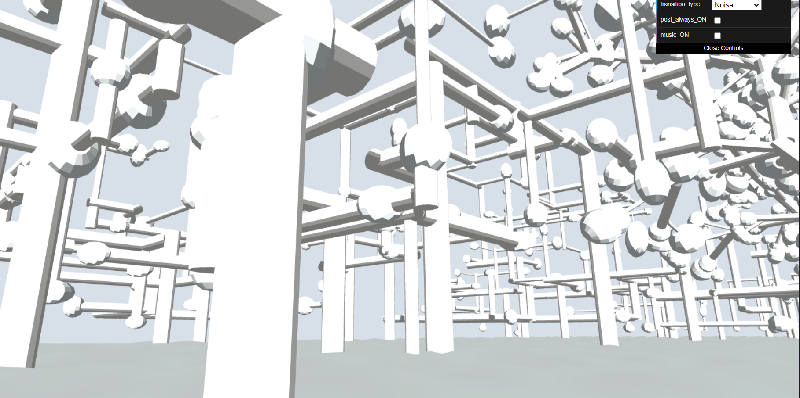
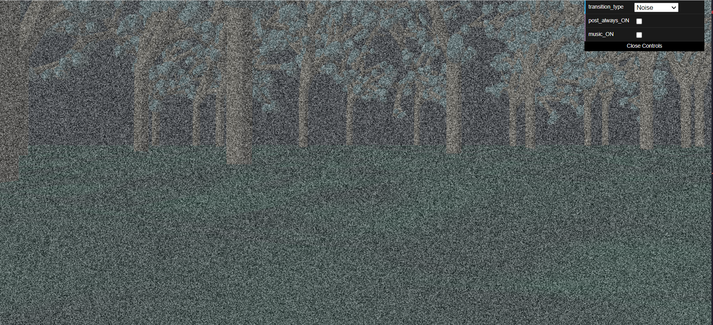
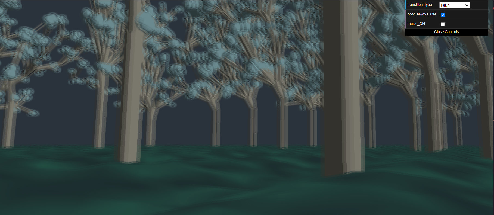
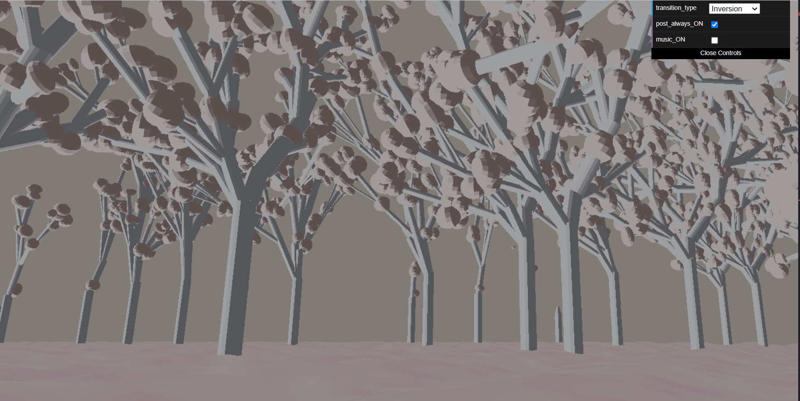
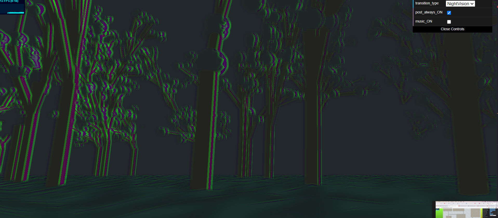
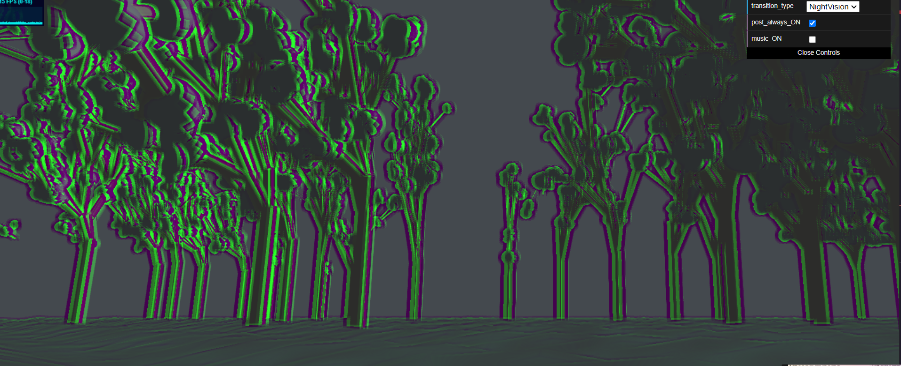
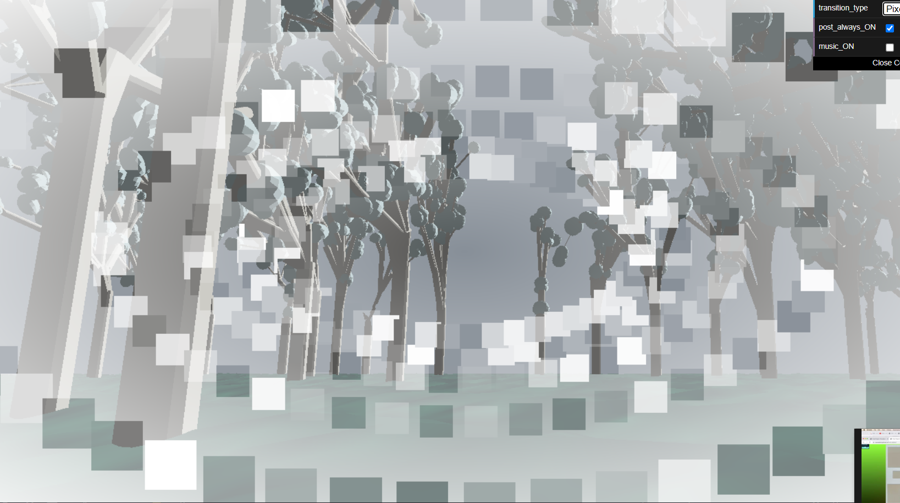

This week, Serena and Di worked on refining the different systems of the project. Di worked on improving the L-systems grammar and adding leaves to the trees. Now the trees have three separate grammar that depending on the distance from where the player spawned. Serena added more post processing shaders like Night Vision, Pixel, and inversion shading. They also added noise to the terrain plane and fiddled with the colors. 

## Final submission (due 12/6)

## Final Results:

(Live Demo Pending!)

### Images

## Post-Mortem:

### How'd it go overall?
It went well! After we had the basic framework (tree and terrain generation, player physics, post-processing support), we were able to get creative. We discovered grammars, colors, textures, shaders and even music that fit the spooky theme and add some spice to our generator.

### Did we accomplish our goals?
We did! 

### Did we have to pivot?
Not really. We chose a project that was in-scope, so we were able to be true to the theme and our original ideas.
