# Final Project!

This is it! The culmination of your procedural graphics experience this semester. For your final project, we'd like to give you the time and space to explore a topic of your choosing. You may choose any topic you please, so long as you vet the topic and scope with an instructor or TA. We've provided some suggestions below. The scope of your project should be roughly 1.5 homework assignments). To help structure your time, we're breaking down the project into 4 milestones:

## Milestone 1: Project planning (due 11/15)
Before submitting your first milestone, _you must get your project idea and scope approved by Rachel, Adam or a TA._

### Design Doc
Start off by forking this repository. In your README, write a design doc to outline your project goals and implementation plan. It must include the following sections:

#### Introduction
Ashley and I plan to build a procedural dragonfly generator in Houdini, in the hopes that we will gain Houdini expertise and have an exportable dragonfly asset at the end. We were inspired by the terrain generation Houdini project to seek further familiarity with Houdini, given that it is an industry standard and a great procedural tool. We noticed that dragonflies’ core features stay consistent, but there are minute differences in the color of the bodies and the branching veins of the wings. We therefore thought that the dragonfly would be a good subject for a procedural asset generator in Houdini.
#### Goal
Our goal is to create a dragonfly generator in Houdini. We want to allow artists to be able to create various different dragonflies by tweaking hda parameters. We want the shape of the body, the wings' shape size and features, as well as the colors of the dragonfly to be editable. 
At the end, we want to have some nice rendered images of various generated dragonflies, as well as an exportable asset that you could theoretically render with a different engine, if desired. We also want to ensure that we have an hda that could be used in any Houdini project.

#### Inspiration/reference:
Our inspiration is images of both real life dragonflies as well as drawings or pictures of the creatures that better showcase some of their details. We were also inspired by the game Spore. 

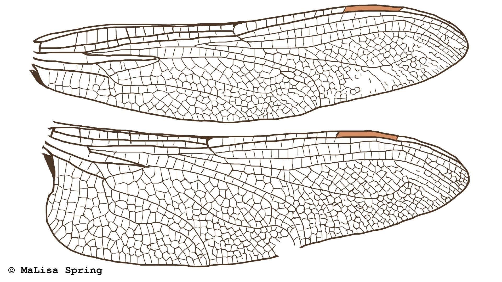

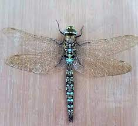

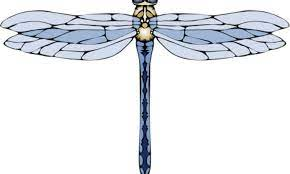

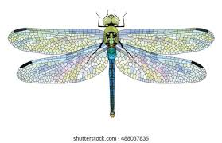

https://www.youtube.com/watch?v=9U_9SErk9xU This is a Houdini walkthrough of a butterfly that we referenced

#### Specification:
Main features include the body shape (main body, eyes, legs, and head), the wing shape, the wing pattern, and the shader. 
Emma will focus on creating the body and wing shape. Ashley will create the wing pattern and we will both work together to create the dragonfly shader. 

#### Techniques:
For the body and wing shapes the techniques used will mostly be related to solving problems in Houdini. Vex will be used to make the model more procedural but it will mostly consist of editing various houdini primitives and using nodes such as transforms, for loops, and curves. There will not be any imported models in this project instead all aspects of the dragonfly will be modeled procedurally with houdini in order to add maximum customization for the user. 
The shader for the dragon will require the use of iridescence on the body and the wings as well as potentially some form of glass for the see through elements on the wings. 
The initial wing veins will be some sort of LSystem structure projected onto the wing shape (following the wing shape, if possible). The LSystem will split the wing into different primitives, and we will use a foreach loop to create a voronoi pattern on each primitive, either with the built-in voronoi node or with vex. 

#### Design:

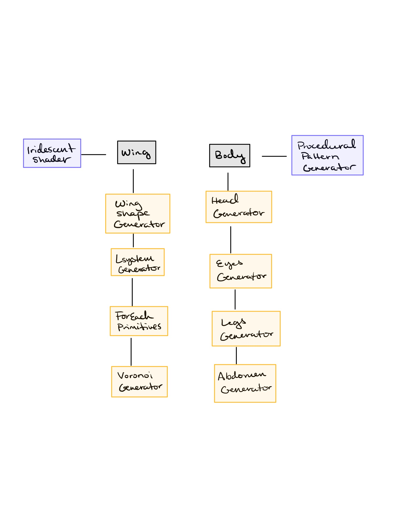

#### Timeline:

#### PreWeek One:

Ashley and Emma
- Research Houdini techniques for the shape and pattern generation in order to see if it would be possible to create in houdini or if we should use WebGL
- Find Houdini tutorial videos that relate to different aspects of our dragonfly generator
- Test wing branching method with voronoi and lsystem nodes
#### Week One:

- Emma:
  - Create single version of body including head, eyes, legs, abdomen, keeping in mind which values will be parameterized upon the creation of the hda
  - Create two different wings (one top wing and one bottom wing) using simple primitives combined together.
- Emma + Ashley:
  - test render with basic shader in order to make sure rendering HDA with a material works
  - Research iridescence for the wing shader
- Ashley:
  - Create lsystem that will partly follow the edge of whatever 2D mesh it’s bound to. The branches of this lsystem should extend to the edges of the bound mesh, but go no further.
  - Project the lsystem down onto the wing shape mesh (just a basic circle or oval for now)
  - Split the wing shape mesh by the lsystem
  - For each created mesh, scatter points and create voronoi system. Then, get the outline of the voronoi system and create small tubes.
#### Week Two:
- Emma:
  - Bug fixes from Week 1
  - Refine wing shape and add more detail to the overall shape
  - Add parameters to wing shape so that multiple variations can be created
- Ashley:
  - Bug fixes from Week 1
  - If the lsystem doesn’t follow the shape of the wing, work on that
  - Add iridescent shader to wings
  - Add wing branching parameters
- Ashley and Emma:
   - Procedural pattern generation for the body (and potentially wings as well)
   - Place wing pattern generation on actual wings. 
   - Create first draft of shader for dragonfly
   - Test renders
#### Week Three
- Ashley and Emma
  - Create hda with parameters for the rest of the body
  - Refine generator based on feedback
  - Refine shader - add parameters to shader
  - Final Renders

# Milestone 2

## Wing Progress

1. Created a basic wing shape 
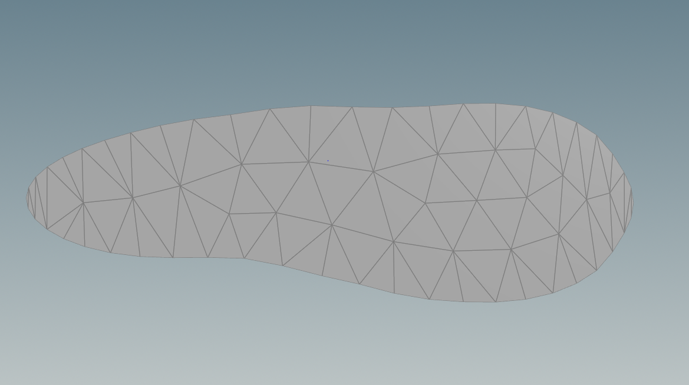

2. Manually drew curve to cut the wing into pieces. In the future, we hope to generate this curve procedurally, but we may need some guidance figuring out how to accomplish this.
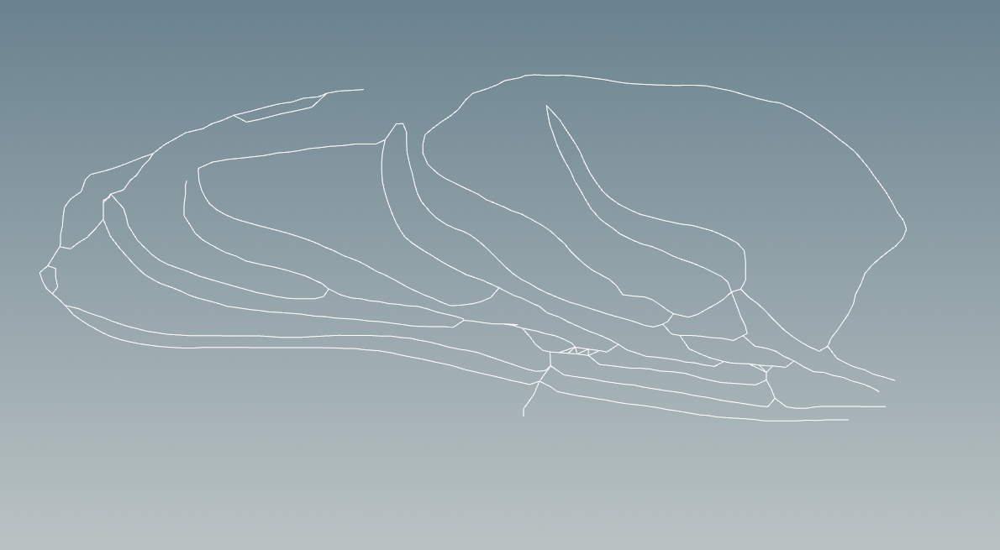

3. Extruded the curve to create a cutting surface
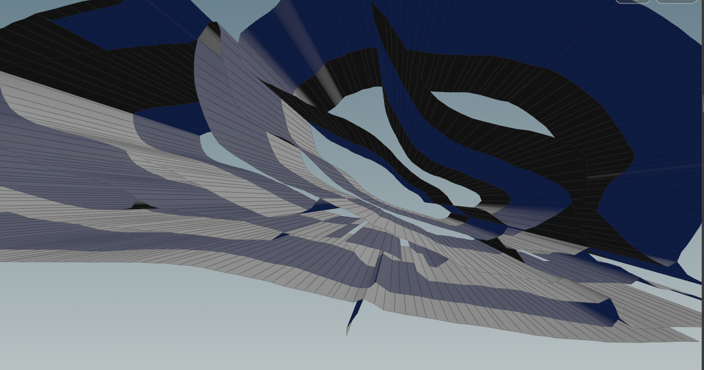

4. Used this cutting surface to cut the wing into pieces (this allows us to scatter voronoi cell points based on piece)
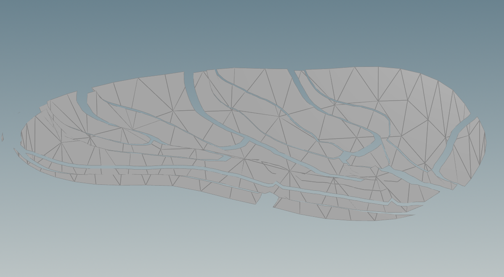

5. Broke the surfaces in a voronoi pattern, coloring each piece differently
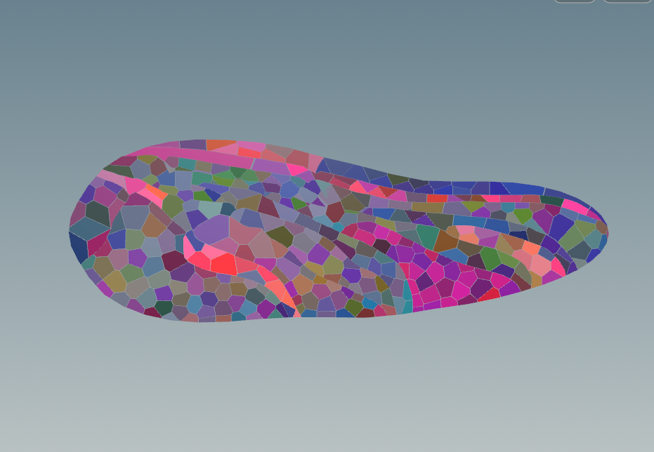

6. Created a tube wireframe using the curve for the veins
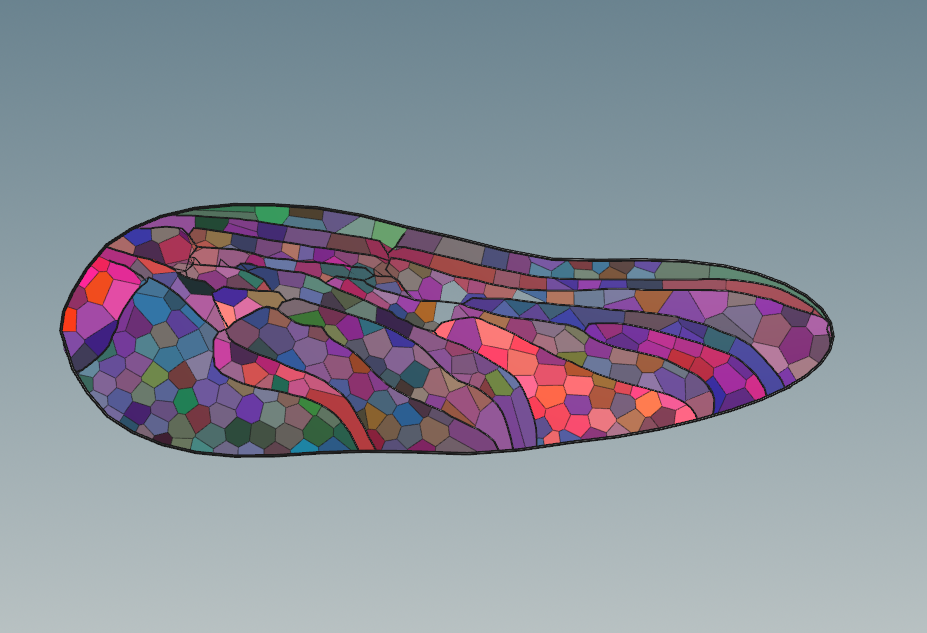

7. Added a transparent material
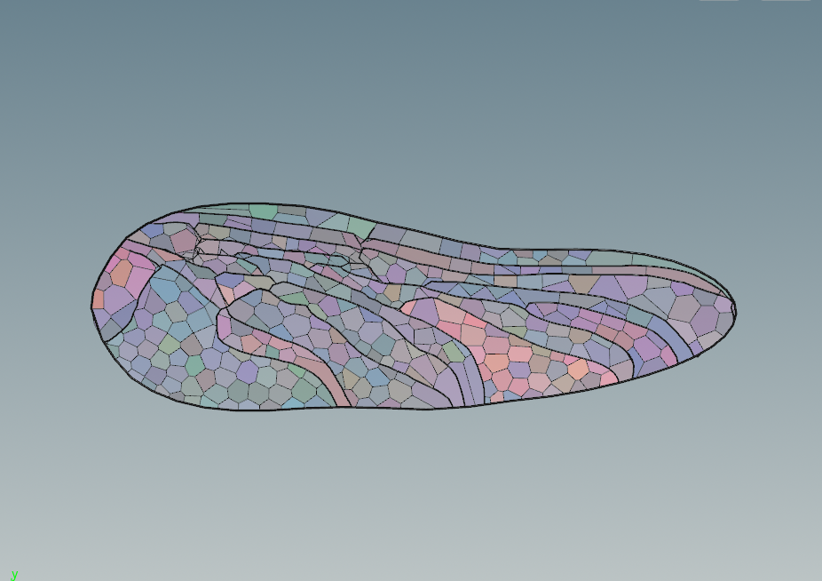

## Body and Wing shape Progress - Emma

This week I worked on creating a generator for the wing shape and body parts to make the dragonfly. I currently have all of the aspects of the dragonfly and the user can control the overall transformation of the bug, the length of the body, and the size of the eyes. This next week I want to focus on allowing the user to edit more parameters and add a little more detail to the indivial aspects of the body to make the overall appearance more realistic. I also want to expand on the materials that Ashley started and have the whole dragonfly be textured. These are some dragonflies the generator can create and the current houdini node network

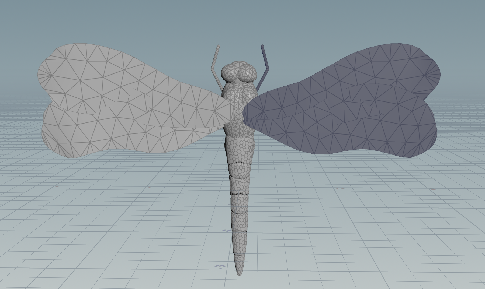

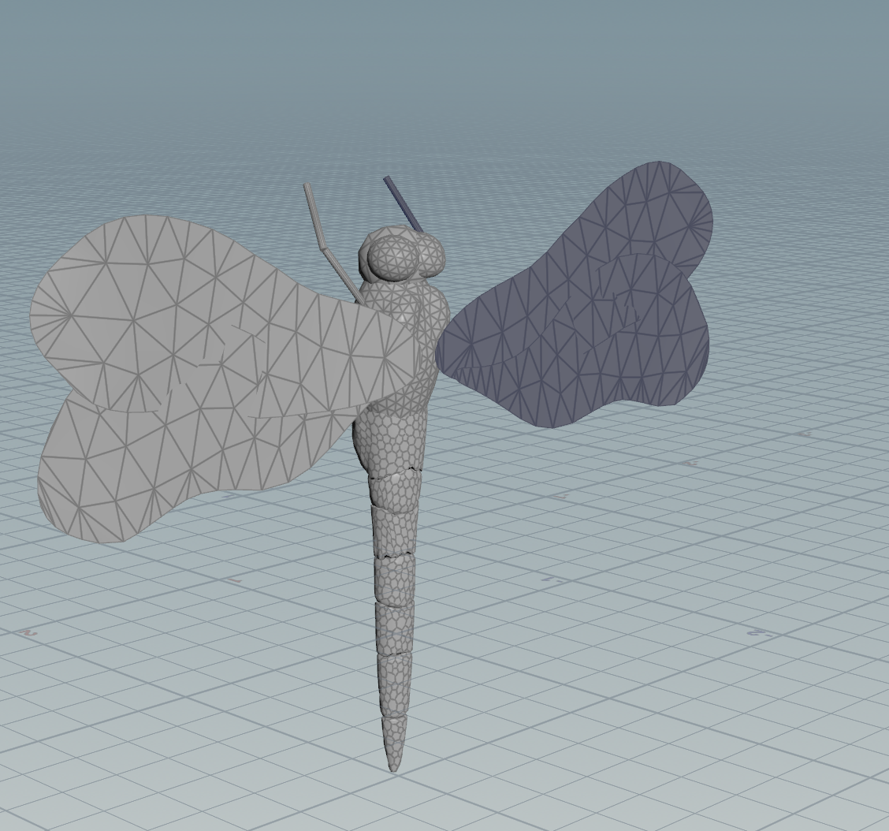

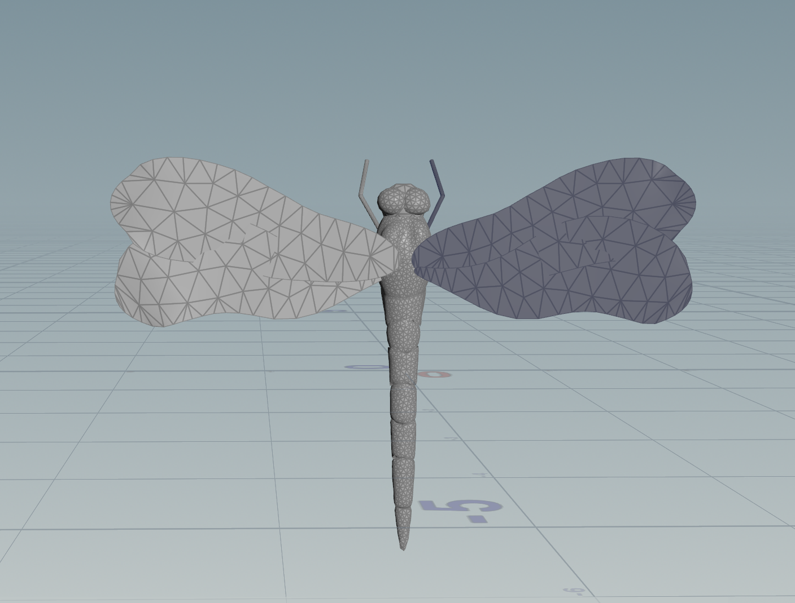

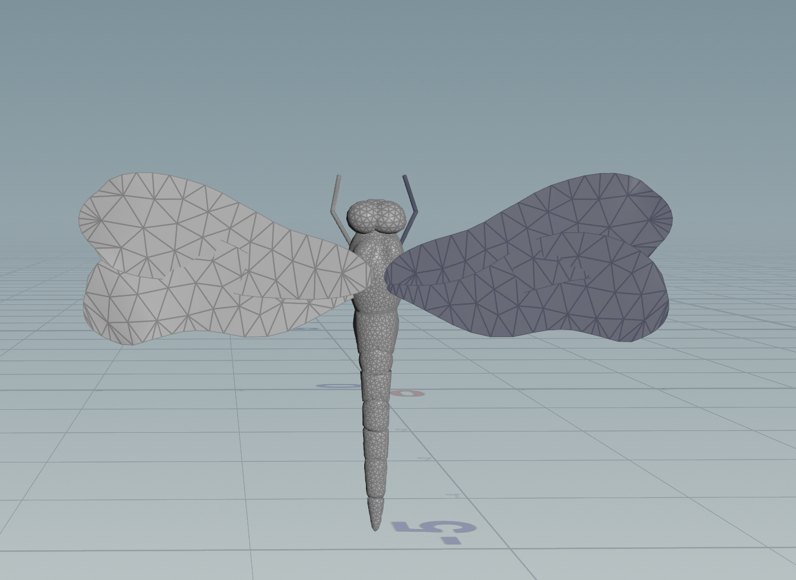

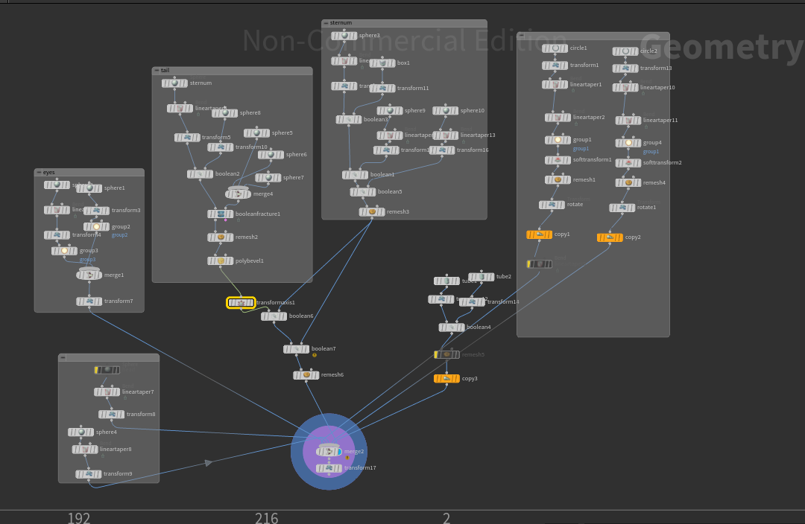

