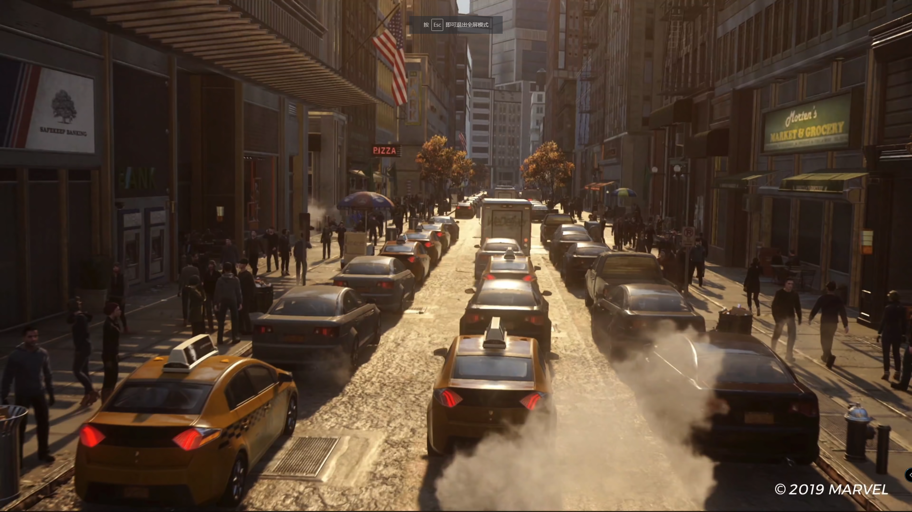
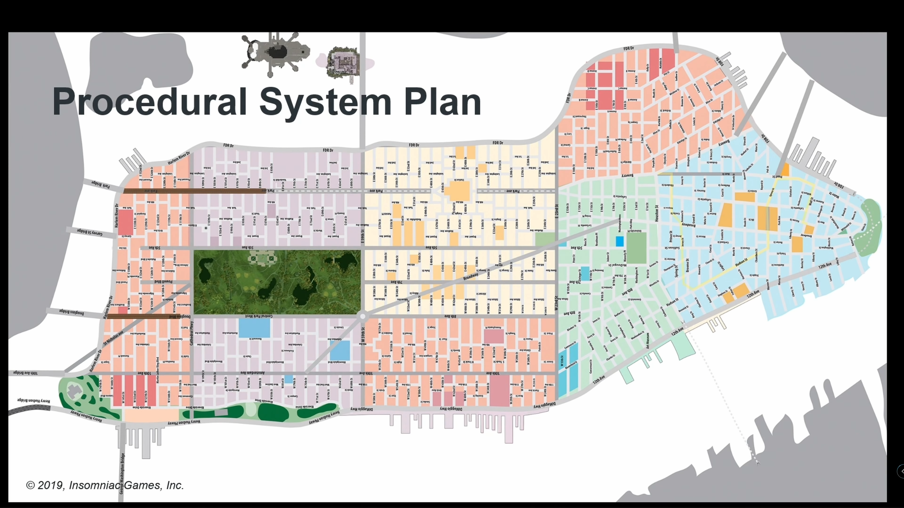
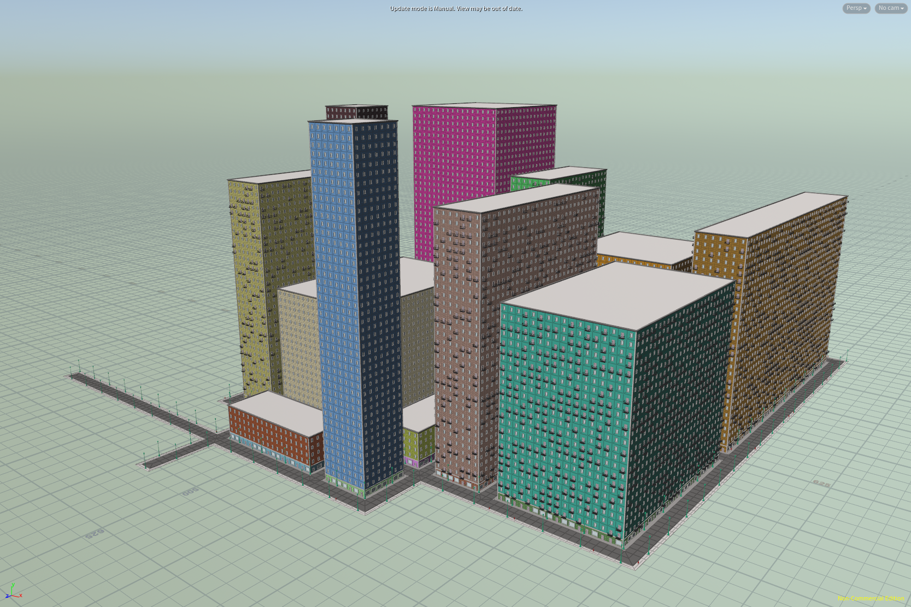
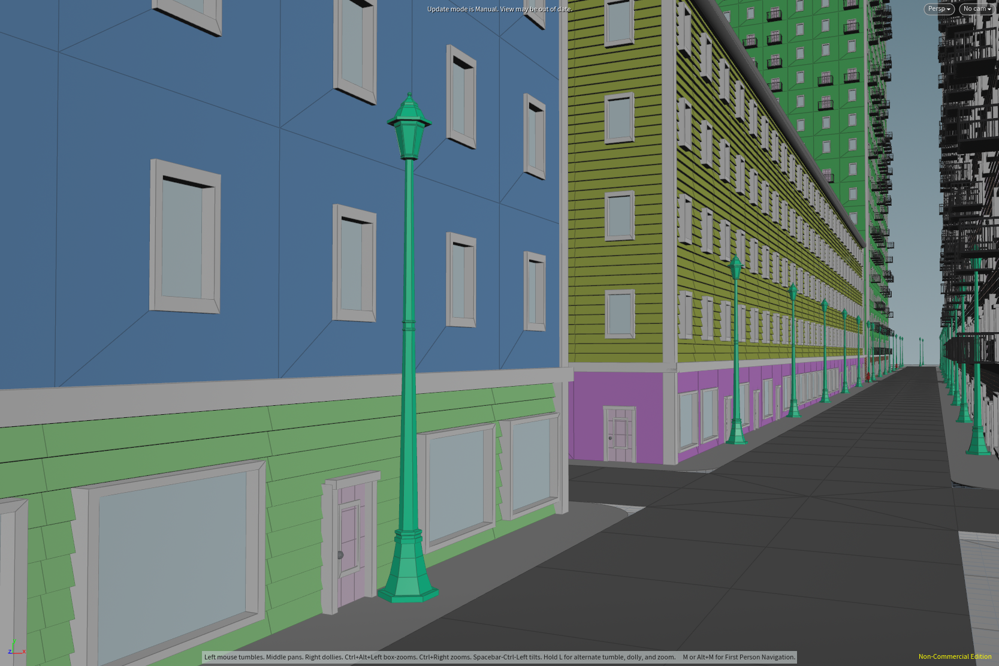
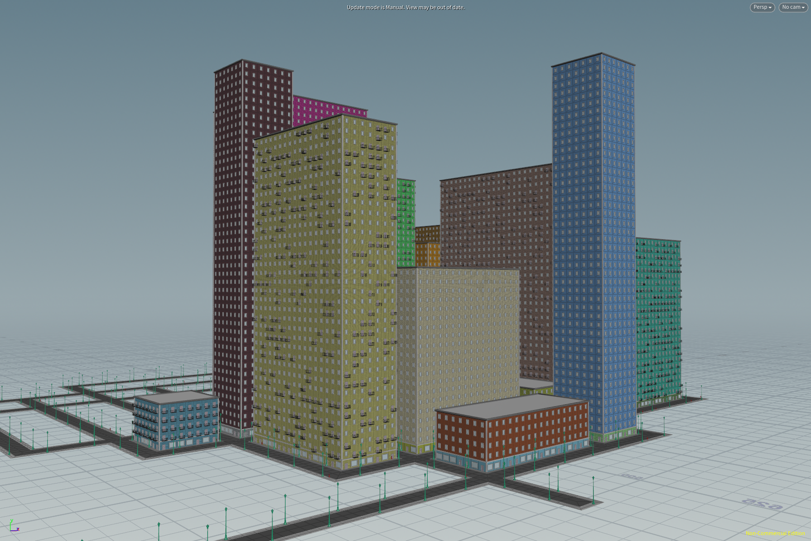
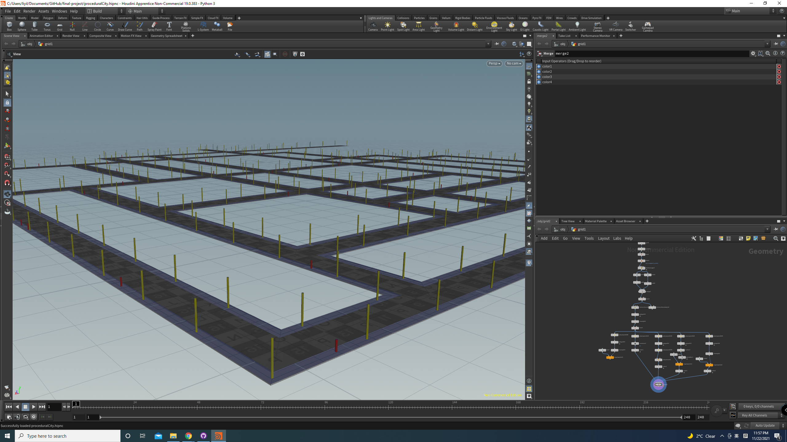
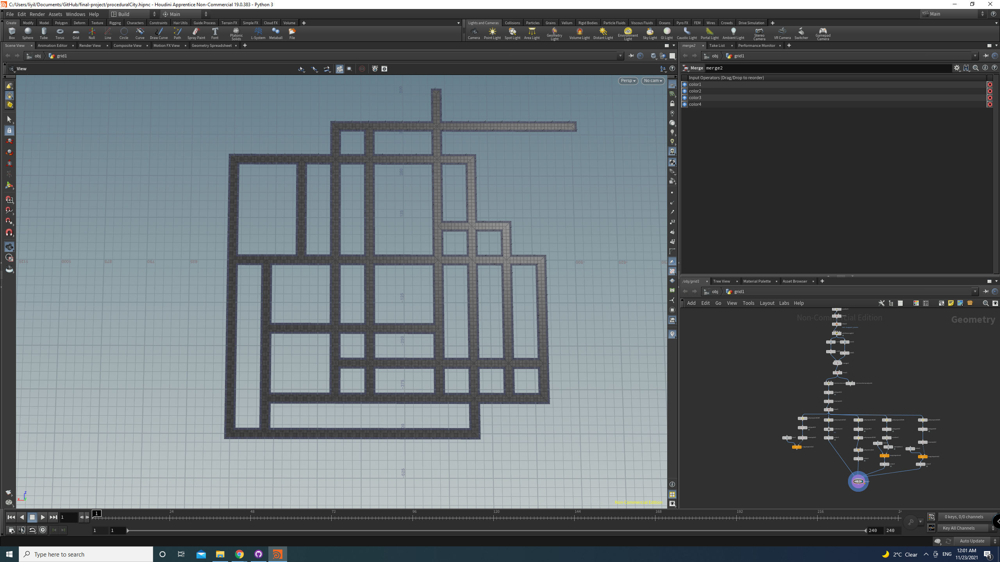
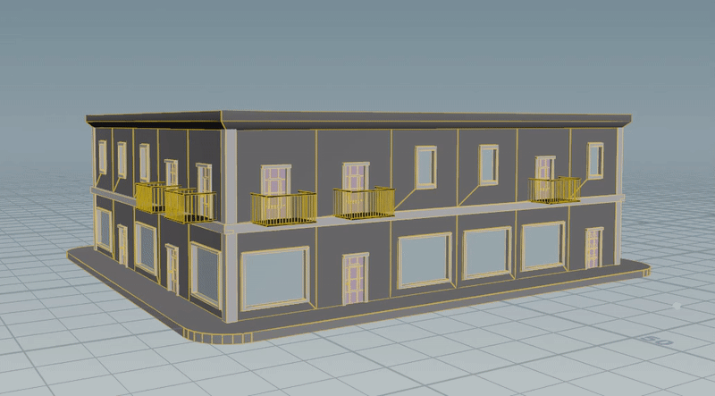
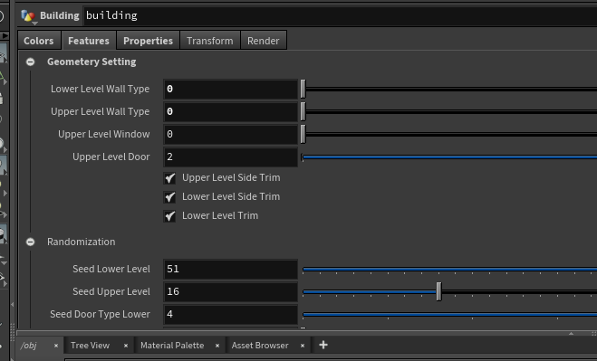

# Final Project Design Document

## Introduction
Modeling and building a large city can be tedious and hard to manage, so a procedural city generator can save the day for artists and provides extra control over many parameters such as streets, buildings, props and other game specific elements such as traffic, and random events.

## Goal
We intend to make a city generator in NYC style with procedural roads and buildings. The generator could be exported to a game engine like UE4 with adjustable parameters.

## Inspiration/reference:

*[Marvel’s Spider-Man by Insomniac Games](https://www.playstation.com/en-us/games/marvels-spider-man/)*

*[Marvel’s Spider-Man, meet Houdini | David Santiago | GDC 2019](https://www.youtube.com/watch?v=D0ERCi9mMZg)*

## Specification:
- Procedurally generate roads (city structures)
- Procedurally generate buildings
- Automatically fit the textures

## Techniques:
- Procedural UV mapping: Given the building size, generate the according UV map. 
- Road generation: Use noise functions or L-Systems to generate the position of the roads.
- Building generation: Procedural extrusion of a plane or a box to generate a random building.

## Design:

## Final Submission:
### Final Results:
#### Result in Houdini: 

#### Control Parameters:

#### Result in Unreal Engine 4

### Post Mortem:
#### Accomplished: 
- We have successfully implemented the city structure generation with roads, sidewalks, street lights, and citizens.
- We have successfully implemented the functionality of generating a colored building.
- We have combined the building generation and the road generation to generate a lively city with colored buildings.
- We have successfully collapsed our houdini nodes into an HDA in which users could generate their own cities simply by adjusting some given values and click the "generate building" button.

#### Have to pivot:
- We did not use UV maps to texture the buildings. Instead, we combined geometries with color together to form a building-like geometry.
- Due to the time limit, we are not able to generate curly roads in the city. All roads are straight.
- Due to unknown efficiency problems, our colored buildings generated on the city structure could only be seen after we render the scene, but not visible in the viewport.

## Timeline:
### Lanqing Bao:
- 11.22: ~~Find a nice building texture and calculate the uv texture mapping for a random size building.~~ updated 11/20: find this way not very doable, switch to generate mesh instead
- 11.29: ~~Integrate the uv calculation into teammate ground generation.~~ updated 11/28: finish the basic building mesh generation
- 12.06: Touch up and maybe add more texture maps. updated 11/28: plus intergation with road generation

### Yilei Li:
- 11.22: Find a way to procedurally generate a building from a blank ground. Visualize the building in a simple way.
- 11.29: Incorporate with Haowei to generate buildings on the ground layout.
- 12.06: Incorporate with Lanqing to generate polished buildings.

### Haowei Li:
- 11.22: Find a way to generate the road structure or the city, and visualize the roads in a simple way.
- 11.29: Define the blocks for procedural buildings generation.
- 12.06: Integrate the roads with the procedural buildings with other teammates. Polish all the work.

## MileStone 1:
### Progress: 
We have figured out using the grid, scatter, and blast node in Houdini to generate the basic road structure of the city. The city can now generate roads with random citizens, side walks, and street lights. (All represented by simple geometries)
#### Screenshots:

- The yellow tubes represent the street lamps with parameterized interval distance and the red tube represents the pedestrians. 

### Issues & planning:
We are still working on the building generation, and we expect it to be down soon. The plan is to fill the holes left on the ground and what we are thinking about is to mimic the approach used in most games where only the outer side of the building is being generated. It is similar to the idea of effcient rendering in Mini Minecraft project during CIS 560. So we planed to utilze points on polypath but with boxes to block everything. We are still fixing some weird issues in tight angles so it can support meshes other than boxes. Our approach is to isolate these angles by some attribute wrangle and do something special with them.

## MileStone 2:
### Progress: 
We have the road and building generation working seperately now. This week we focus more on the building generation. Firstly we tried to map some nice 2D wall & window texture to random size boxes and struggled with calculating UV, which didn't work very well both visually and mathmatically. Thus we switch to model generation. To simplify, all the building will be cuboid and we modeled several pattern like plain wall, brick wall, door etc and assemble them randomly. 
#### Screenshots:

- Building generation

- Some adjustable parameters

### Issues & planning:
Next we are going to combine building and road generation together and polish them. Right now everything is plain colored so we will probably add some textures. We have to work on more about tiling to ensure there is no weird repetition. 
