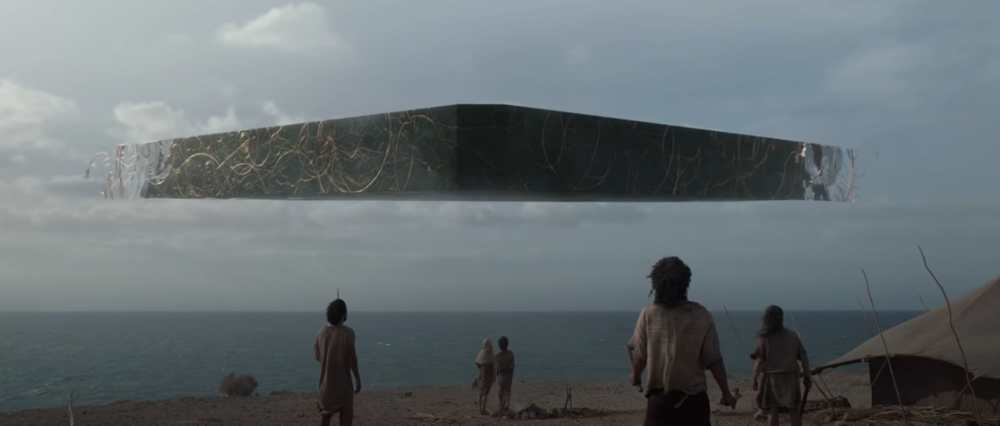
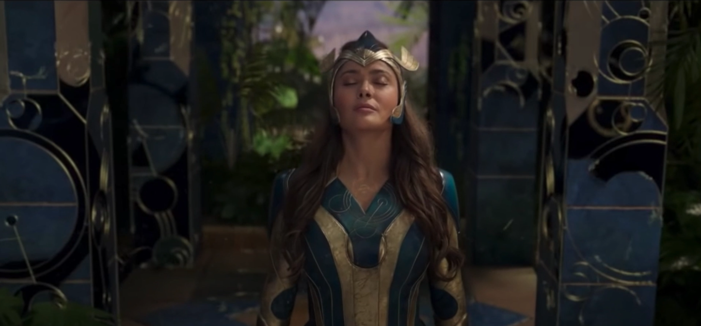
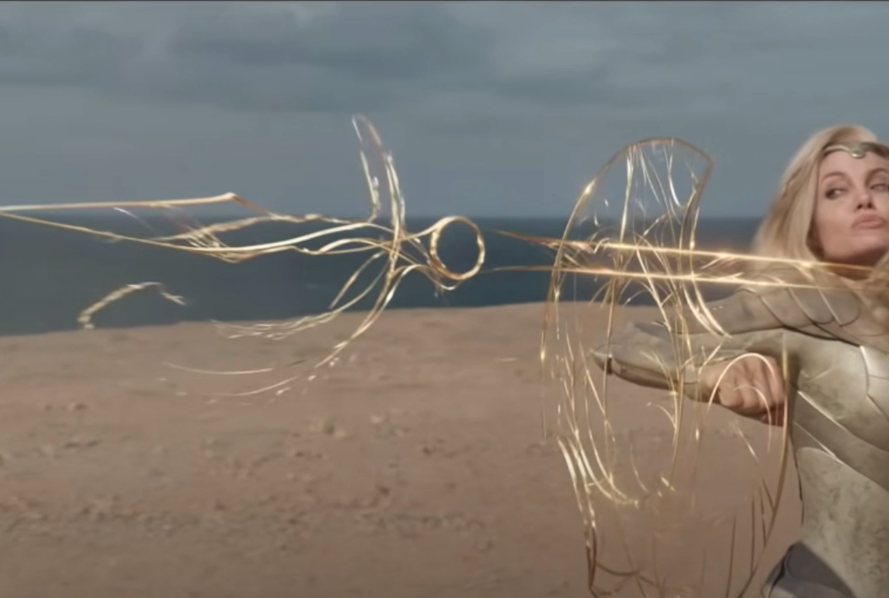
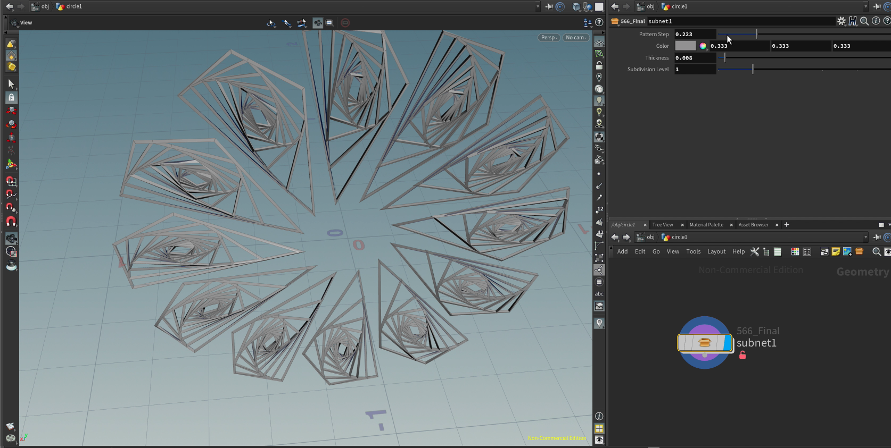
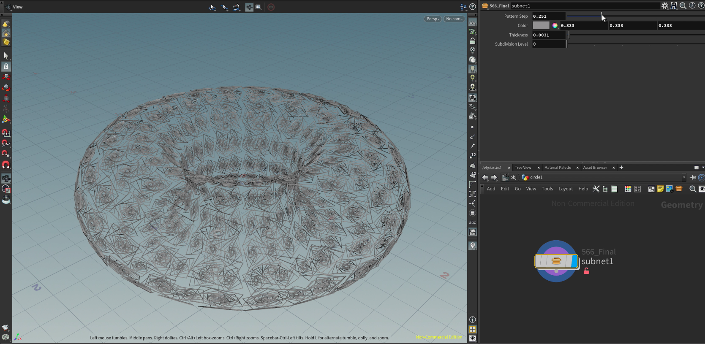
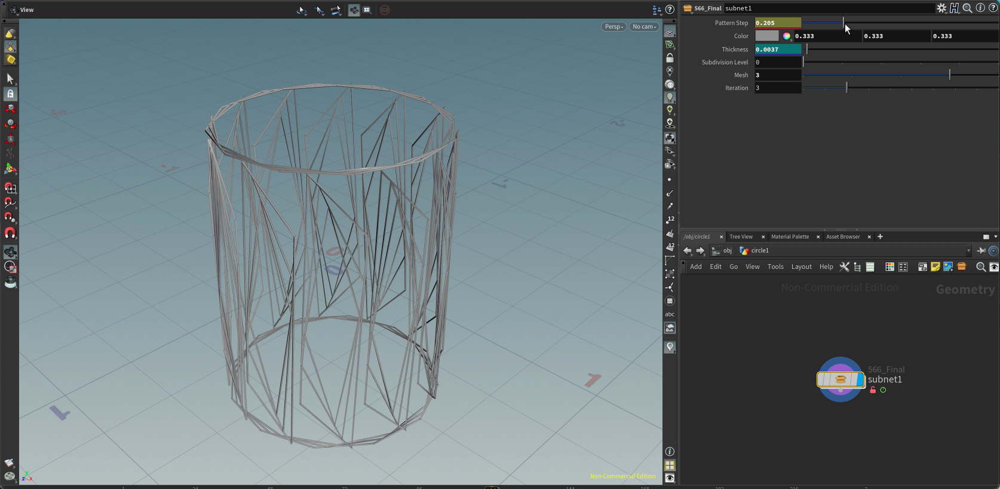
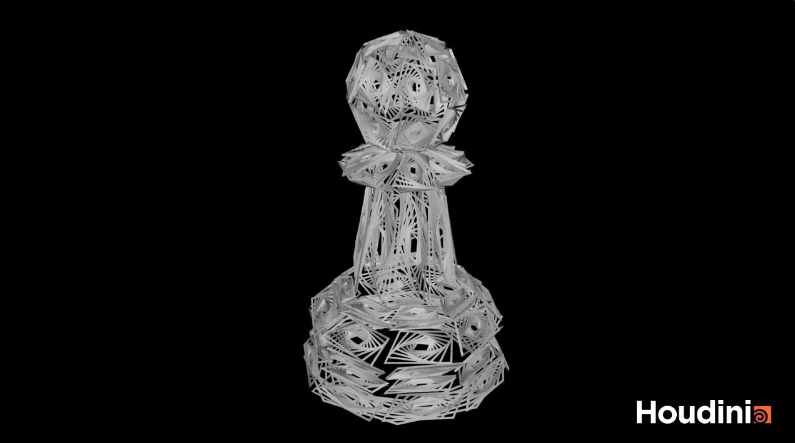

# Final Project!

This is it! The culmination of your procedural graphics experience this semester. For your final project, we'd like to give you the time and space to explore a topic of your choosing. You may choose any topic you please, so long as you vet the topic and scope with an instructor or TA. We've provided some suggestions below. The scope of your project should be roughly 1.5 homework assignments). To help structure your time, we're breaking down the project into 4 milestones:

## Milestone 1: Project planning (due 11/15)
Before submitting your first milestone, _you must get your project idea and scope approved by Rachel, Adam or a TA._

### Design Doc
Start off by forking this repository. In your README, write a design doc to outline your project goals and implementation plan. It must include the following sections:

#### Introduction
- What motivates your project?
- I have been always amazed by VFX and various effects in moveis, such as Marvel. This course is my first time actually using Houdini for assignments and using nodes properly. After having a slight beignning experience from past assignment, I wanted to create some kind of effect like in moveis. For this project, I want to create a pattern creation tool, which creates a pattern based on object's shapes and forms.

#### Goal
- What do you intend to achieve with this project?
- I hope I can create a tool that can be used for any mesh and objects to create cool animated effect of pattern geration based on their forms and shapes.

#### Inspiration/reference:
- Reference Images:
  - Spaceship being visible with the patterns:
    - 
  - Unique patterns being created in the pillars:
    - 
  - Unique patterns forming the shape of the weapons:
    - 

#### Specification:
- Outline the main features of your project.
  - Create a HDA using houdini that generates patterns based on the objects
  - Various parameters that change the patterns and effects
  - Create cool clips using it

#### Techniques:
- What are the main technical/algorithmic tools you’ll be using? Give an overview, citing specific papers/articles.
  - The circular patterns from the references seem like it can be acheicved using curves in a smart way. The curves cannot be generated fully random, as it has to be bounded by the shape of the objects. I plan on adopting the concept of bezier curve, so that the curves can be constrained by points, which are based on the polygons of the object.

#### Design:
- It will be a one HDA that have the parameters to modify, in order to create the patterns.

#### Timeline:
- Week 1: Go over concept of bezier curve and go thoguth some houdini tutorials to get used to the tool.
- Week 2: Create basic HDA with the core functionality. Also add simple parameters if time allows.
- Week 3: Add extra parameters for more room to diversify the patter effect. Then create some cool exmaples using the tool for demo.

Submit your Design doc as usual via pull request against this repository.
## Milestone 2: Implementation part 1 (due 11/22)

#### Inspiration/reference:
- Current Effect with Circle:
  - 
- Current Effect with Torus:
  - 
- Demo link (Contains all the work from the beginning to the end):
  - https://drive.google.com/file/d/1sWnxZTYipLPS3HunV9NaYE57L9MQka71/view?usp=sharing

#### Progress Report:
- Basic functionality of having several iterations of each face of the object to create basic circulating effect. Also have basic parameters to see the effect in animation using keyframes.
    
## Milestone 3: Implementation part 2 (due 11/29)

#### Images:
- Current Effect with Cylinder:
  - 
- Demo link (Contains all the work from the beginning to the end):
  - https://drive.google.com/file/d/1sWnxZTYipLPS3HunV9NaYE57L9MQka71/view?usp=sharing

#### Progress Report:
- Added few more parameters such as changing iterations and switching primitives to see the pattern effect. I will be adding more cool shapes to create better visual demo.

## Final submission (due 12/6)

#### Images
- Screenshot of a Pawn with effect:
  - 
- Pawn with effect Demo:
  - https://drive.google.com/file/d/1mz8MBiCTRei4MECP5p43aBbQcQ7oMnwV/view?usp=sharing
- Demo link (Contains all the work from the beginning to the end):
  - https://drive.google.com/file/d/1sWnxZTYipLPS3HunV9NaYE57L9MQka71/view?usp=sharing

#### Progress Report:
- The overall outcome is satisfying. If I had more time and expereince with Houdini, I would've go forth and get the actual bezier curve effects also as additional features for more circular patterns, intead of just spinning effect. That addition would've made the outcome more similar to the references. I added a pawn object file for more interesting demo than just primitives.

Submission:
- Push all your code / files to your repository
- Come to class ready to present your finished project
- Update your README with two sections 
  - final results with images and a live demo if possible
  - post mortem: how did your project go overall? Did you accomplish your goals? Did you have to pivot?

## Topic Suggestions

### Create a generator in Houdini

### A CLASSIC 4K DEMO
- In the spirit of the demo scene, create an animation that fits into a 4k executable that runs in real-time. Feel free to take inspiration from the many existing demos. Focus on efficiency and elegance in your implementation.
- Example: 
  - [cdak by Quite & orange](https://www.youtube.com/watch?v=RCh3Q08HMfs&list=PLA5E2FF8E143DA58C)

### A RE-IMPLEMENTATION
- Take an academic paper or other pre-existing project and implement it, or a portion of it.
- Examples:
  - [2D Wavefunction Collapse Pokémon Town](https://gurtd.github.io/566-final-project/)
  - [3D Wavefunction Collapse Dungeon Generator](https://github.com/whaoran0718/3dDungeonGeneration)
  - [Reaction Diffusion](https://github.com/charlesliwang/Reaction-Diffusion)
  - [WebGL Erosion](https://github.com/LanLou123/Webgl-Erosion)
  - [Particle Waterfall](https://github.com/chloele33/particle-waterfall)
  - [Voxelized Bread](https://github.com/ChiantiYZY/566-final)

### A FORGERY
Taking inspiration from a particular natural phenomenon or distinctive set of visuals, implement a detailed, procedural recreation of that aesthetic. This includes modeling, texturing and object placement within your scene. Does not need to be real-time. Focus on detail and visual accuracy in your implementation.
- Examples:
  - [The Shrines](https://github.com/byumjin/The-Shrines)
  - [Watercolor Shader](https://github.com/gracelgilbert/watercolor-stylization)
  - [Sunset Beach](https://github.com/HanmingZhang/homework-final)
  - [Sky Whales](https://github.com/WanruZhao/CIS566FinalProject)
  - [Snail](https://www.shadertoy.com/view/ld3Gz2)
  - [Journey](https://www.shadertoy.com/view/ldlcRf)
  - [Big Hero 6 Wormhole](https://2.bp.blogspot.com/-R-6AN2cWjwg/VTyIzIQSQfI/AAAAAAAABLA/GC0yzzz4wHw/s1600/big-hero-6-disneyscreencaps.com-10092.jpg)

### A GAME LEVEL
- Like generations of game makers before us, create a game which generates an navigable environment (eg. a roguelike dungeon, platforms) and some sort of goal or conflict (eg. enemy agents to avoid or items to collect). Aim to create an experience that will challenge players and vary noticeably in different playthroughs, whether that means procedural dungeon generation, careful resource management or an interesting AI model. Focus on designing a system that is capable of generating complex challenges and goals.
- Examples:
  - [Rhythm-based Mario Platformer](https://github.com/sgalban/platformer-gen-2D)
  - [Pokémon Ice Puzzle Generator](https://github.com/jwang5675/Ice-Puzzle-Generator)
  - [Abstract Exploratory Game](https://github.com/MauKMu/procedural-final-project)
  - [Tiny Wings](https://github.com/irovira/TinyWings)
  - Spore
  - Dwarf Fortress
  - Minecraft
  - Rogue

### AN ANIMATED ENVIRONMENT / MUSIC VISUALIZER
- Create an environment full of interactive procedural animation. The goal of this project is to create an environment that feels responsive and alive. Whether or not animations are musically-driven, sound should be an important component. Focus on user interactions, motion design and experimental interfaces.
- Examples:
  - [The Darkside](https://github.com/morganherrmann/thedarkside)
  - [Music Visualizer](https://yuruwang.github.io/MusicVisualizer/)
  - [Abstract Mesh Animation](https://github.com/mgriley/cis566_finalproj)
  - [Panoramical](https://www.youtube.com/watch?v=gBTTMNFXHTk)
  - [Bound](https://www.youtube.com/watch?v=aE37l6RvF-c)

### YOUR OWN PROPOSAL
- You are of course welcome to propose your own topic . Regardless of what you choose, you and your team must research your topic and relevant techniques and come up with a detailed plan of execution. You will meet with some subset of the procedural staff before starting implementation for approval.
