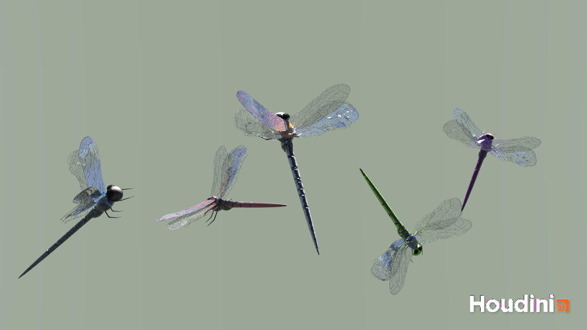

# Houdini Dragonfly Generator
**Authors:** Ashley Alexander-Lee, Emma Holthouser

**For:** CIS566 - Procedural Graphics

# Introduction

Our dragonfly generator is an hda, Houdini Digital Asset, that you can install and use to generate unique dragonflies. This was our first foray into creating a complex digital asset in Houdini, and we have learned so much throughout the process. Our generator is composed of two parts:

1. Body Generator
2. Wing Generator

We wanted to create not only an hda but also a render which showcases a potential use for our tool. We were inspired by images of of swarms and groups of dragonfly and artistic renderings of these groups.

# Installation
1. Open dragonflyScene.hip
Or
1. Download dragonfly_final.hdanc
2. In a new Houdini file, go to File -> Import
3. Choose the dragonfly.hdanc file
4. Select "Install and Create"

# Usage
| Parameter | Default | Description |
| --------- | ----- | ----------- |
| Random Seed | 9 | Seed value used to randomize the parameters|
|Randomize Checkbox | off | this checkbox changes the dragonfly from using parameters to be randomly generated |
| | |
| | |
| Tail Divisions | 3 | Number of tail segments | 
| Tail Division Size | 1 | Length of each tail segment |
| Tail Length | 1.15 | Total Length of the tail |
| | |
| | |
| | |
| Top Wing Taper | 1.1 | Width of the tips of the top wings |
| Top Wing Angle | 0 | Controls curve of the top wings |
| Bottom Wing Taper | 1.1 | Width of the inside tips of the bottom wings |
| Bottom Wing Angle | 0 | Controls curve of the bottom wings |
| | |
| | |
| | |
| Eye Size | 0.16 | Size of the eyes |
| Head Size | 0.13 | Size of the head |
| Body Width | 1 | Width of the body |
| Body Color | Rgb( 0.2, 0.727, 1 ) | Color of the head and tail, as well as the vein color if wing tinge is on |
| Body Secondary Color | Rgb( 0, 0.302, 0.106 ) | Color of the sternum, as well as the wing tinge |
| Tinge Wings with Body Color | on | Let some of the body color seep into the wings |
| Color Coverage | 0.9 | Amount of black in the tail |

# Milestone Upates

We have a different file with the milestone updates includign for the final upload as well as a video demo of the tool

